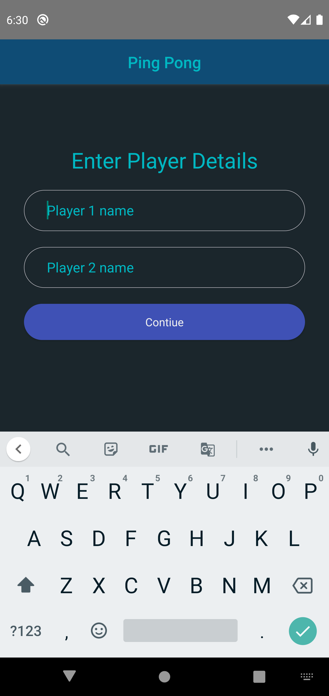
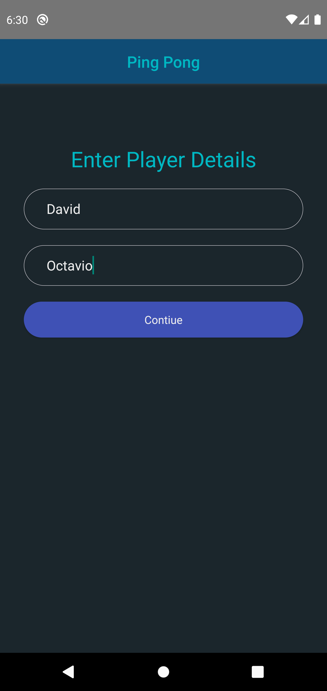
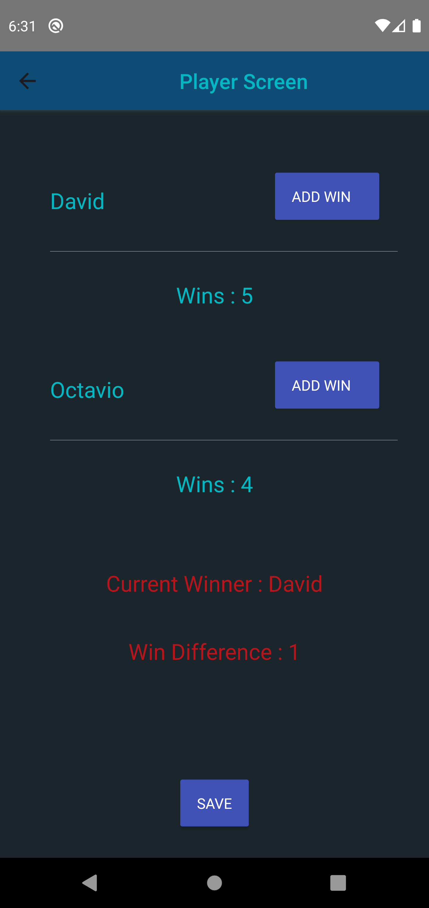
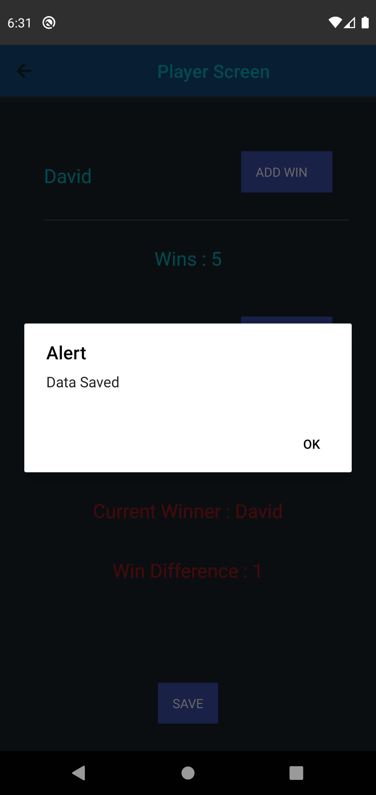

### Ping Pong :tada: :rocket:

Simple app made with react-native written in javascript

### Libraries used :muscle:

- React Navigation ( for navigation )
- Native base ( for UI )
- Redux , React-redux ( for state management )
- AsyncStorage ( Storing player data)

### Validations

- Form Validations ( check for empty values )

## How to setup ?

Clone the repo using the git clone

```
$git clone https://github.com/avijeetpandey/ping_pong.git
```

cd into ping_pong and run the following command

```
yarn install
yarn run android
```

This will setup , build and launch the app in emulator or in physical device

### App UI ( Screens )

**App Screens**<br>





### Made with ❤ by Avijeet , using React-Native
